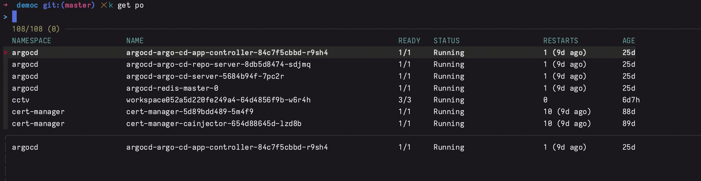

[简体中文](README.zh-CN.md)

# Introduction

Smkubectl=kubectl+fzf+zsh completion is a tool used to execute commands in the Kubernetes environment. Kubernetes is an operating system used to manage containerized applications, running on distributed clusters. Kubectl is a command-line tool for interacting with Kubernetes clusters, fzf is a tool for performing interactive searches in text files, and zsh completion is a completion tool for automatically completing commands.

The design of this tool combination is to improve the command execution efficiency of users in the Kubernetes environment. Kubectl provides a rich command set for managing various resources on the Kubernetes cluster. However, these commands are often lengthy, and entering all commands at once in the terminal can be cumbersome. Fzf provides interactive search functionality, allowing users to select the desired command through keyboard shortcuts or fuzzy search. Finally, zsh completion can automatically complete commands based on the prefix entered by the user, reducing the workload of user input.


# Characteristics

* Supports automatic completion of commands such as kubectl, go, git, and kill
* No other dependencies, one file 'smkubectl' takes care of everything
* No complex and tedious fzf configuration, no need to install fzf commands
* Automatically generate zsh completion configuration, simple configuration is sufficient, no need for complex zsh | zsh completion configuration
* Ready to use out of the box, improved efficiency, simple and easy to use

# Dependency

To use this tool combination, you need to install and configure kubectl, fzf, and zsh. The following are the steps for installation and configuration:


* Install kubectl
* No need to install fzf [buildin]
* Install zsh


By using a combination of kubectl, fzf, and zsh completion tools, you can improve the efficiency of executing commands in the Kubernetes environment, making your work easier.

# Installation

1. Install

```

go install github. com/lflxp/ smkubectl@latest

```

2. zsh enables automatic completion

*Zsh*

```Zsh

autoload - U compinit&&compinit - u

source<(smkubectl completion zsh)

```

*Bash*

```Bash
autoload - U compinit && compinit - u

source<(smkubectl completion bash)
```

3. Establish a Kubectl soft connection (optional)

```
ln - s ` which kubectl `/usr/local/bin/k
```

# Using

## Shortcut keys

> ~

## Operation

* k+~
* k g+~
* k get+~
* k get po+~(no spaces)
* k get po+~(with spaces)
* k edit po - n
* k get po - n namespace pod - c+~
* k logs - f+~

## DEBUG mode

### Enable DEBUG logs

```zsh
source <(smkubectl completon zsh -d)
```
or
```bash
source <(smkubectl completon bash -d)
```

### Set completion log input environment variables 

```bash
export BASH_COMP_DEBUG_FILE=/tmp/1
tail -f $BASH_COMP_DEBUG_FILE
```

# Supported commands

- [x] kubectl&&k
- [x] kill
- [x] Git
- [ ] ssh
- [x] go
- [x] showme

# TODO

- [ ] 完成smkubectl新旧架构 
- [ ] 新增git命令支持
- [ ] 新增go
- [ ] 新增kill
- [ ] 新增showme